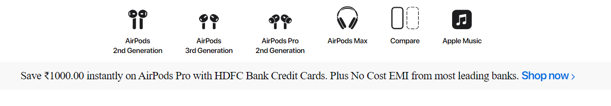
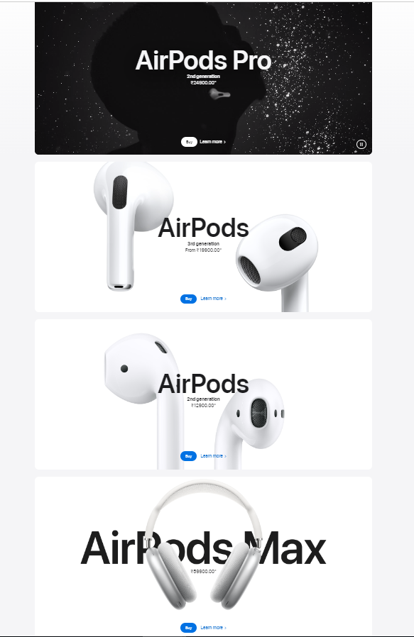
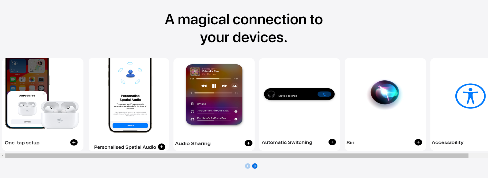
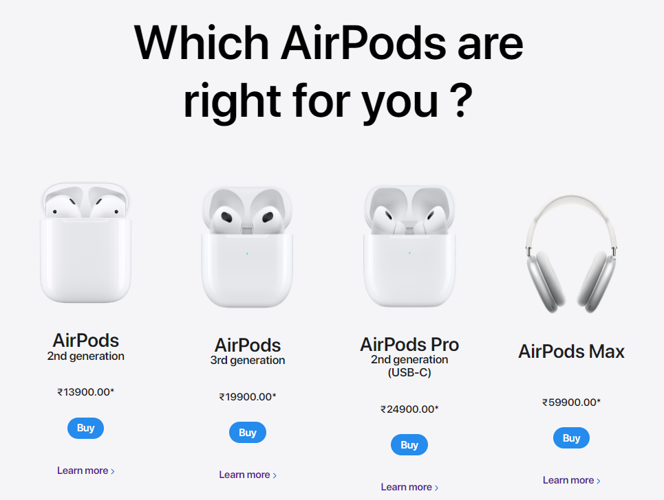
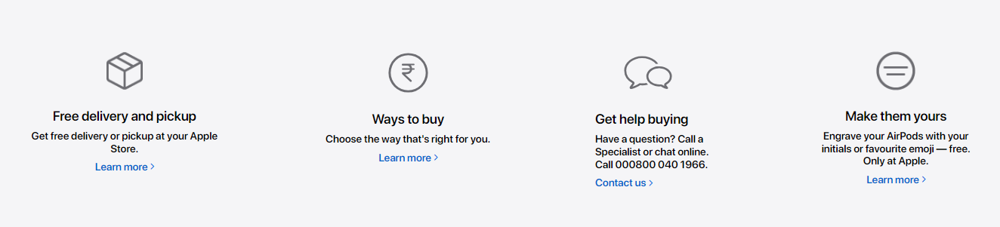

# AirPods Clone Project :
		This project is a clone of Apple's AirPods section(www.apple.com/in/airpods/), created using HTML and CSS.

## Project Overview :
		This project is a front-end web development exercise aimed at replicating the design and layout of Apple's AirPods section on their official website. The goal was to enhance my HTML and CSS skills by recreating a visually appealing and responsive webpage.

# Apple_AirPods_Ui
<h2>Hosted Link</h2>
https://shivambansal96.github.io/TEAM-APPLE-GEEKATHON/AirPods_by_Rishi/Apple%20Clone/

 
 

<h3>Header Section</h3>

 
   Header section consist of two sub-sections: Navbar section and Ribbon. Used flex:display property to make block element inline also used various flex properties to align the content.
 
   Used hover property to change color of text on hovering and an animation is also applied on navbar
 
 

<h3>Main section</h3>

  
   This section consist of a Video and three images. The main section is the prominent and visually impactful area at the top of a web page or digital interface. It serves as the first point of interaction with users, immediately capturing their attention and conveying key information about the website's purpose, content, or message. 
 
 

<h3>Cards section</h3>

 
   It consist of cards in which we are having image and some information about the image.Cards are often arranged in a grid or stack, making them easy to scan and interact with. They provide a user-friendly way to showcase content, such as articles, products, or user profiles, allowing for organized and engaging presentation of information.
 
 

<h3> Content </h3>

 
   Welcome to the Content Section of our website! Here, you'll find a curated collection of airpodes from which you can select the airpod which you like most by knowing all of their features on a single page. 
   Thank you for visiting, and we hope you enjoy the experience!
 
 

<h3> Footer Section</h3>

 

   A footer is a designated section typically found at the bottom of a webpage, document, or other digital content. It serves as a way to provide additional information, navigation, or context to users. Footers often include elements such as copyright notices, contact information, links to important pages, social media icons, and disclaimers. They play a crucial role in enhancing user experience by offering relevant information and facilitating easy access to key resources, even when users have reached the end of the main content.

## Technologies Used :
      In this project I have used many tags of HTML some of the main tags are mantioned below:- 
         1. <meta>
         2. <title>
         3. <link> 
         4. <nav>
         5. <section> 
         6. <video>
         7. 
         8. <h1>, <h2>, <h3>
         9. 

         10. <a>
         11. <button>
         12. 

         13. <footer>
         14
         15. <script>

      The tags which are used in CSS are as follows:-
         1. margin
         2. padding
         3. font-family
         4. font-size
         5. font-weight
         6. object-fit
         7. background-color
         8. display : block, inline, flex
         9. position: relative, absolute, fixed
         10. justify-content
         11. overflow
         12. opacity
         13. letter-spacing
         14. z-index
         15. @media screen	

## External Packages :
      - [Font Awesome] (https://fontawesome.com/): Used for icons.
      - [Animation] (https://animate.style)

## Learning Points :
   	- Improved understanding of HTML and CSS.
	- Image Embedding
      	- Styling Techniques
      	- Animations
      	- Version Control with Git
      	- Responsive Design
      	- Debugging Skills
