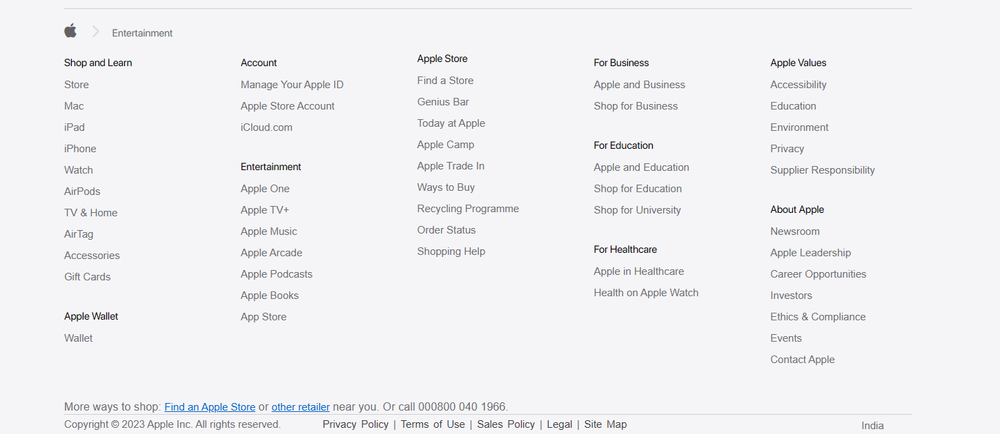

# Entertainment Page Clone Project :
		This project is a clone of Apple UI section(https://shivambansal96.github.io/TEAM-APPLE-GEEKATHON/Entertainment%20by%20Shivam/), created using HTML and CSS.

## Project Overview :
This project is a front-end web development exercise aimed at replicating the design and layout of Apple's Homepage on their official website. The goal was to enhance my HTML and CSS skills by recreating a visually appealing and responsive webpage.

The cloned page includes key elements such as product images, descriptions, and pricing details, all styled to closely resemble the original AirPods page. To add an interactive touch, I incorporated subtle animations and utilized Font Awesome for consistent and attractive icons.

Header Section

Header section consist of two sub-sections: search bar section and navbar section. Used flex:display property to make block element inline also used various flex properties to align the content.
Used hover property to change color of text on hovering.

Hero section

This section consist of only a Image. The hero section is the prominent and visually impactful area at the top of a web page or digital interface. It serves as the first point of interaction with users, immediately capturing their attention and conveying key information about the website's purpose, content, or message.

Image Carousel Section

This section contains images which are arranged in a row. It moves like a banner from right to left on which when we hover the images travel downwards to show a difference in the images.

Footer Section 

A footer is a designated section typically found at the bottom of a webpage, document, or other digital content. It serves as a way to provide additional information, navigation, or context to users. Footers often include elements such as copyright notices, contact information, links to important pages, social media icons, and disclaimers. They play a crucial role in enhancing user experience by offering relevant information and facilitating easy access to key resources, even when users have reached the end of the main content.

## Tags Used :
	In this project I have used many tags of HTML some of the main tags are mantioned below:- 

	Semantic Tags:
		
		1. <section>
		2. <title>
		3. 
		4. <video>
		5. <h1> <h2>
		6. 

		7. <button>
		8. <footer>

	Non-Semantic Tags: 

		1. <meta>
		2. 

		3. <a>
		4. <i>
		5. <script>

	The tags which are used in CSS are as follows:-
		1. margin
		2. padding
		3. font-family
		4. font-size
		5. font-weight
		6. object-fit
		7. background-color
		8. display: flex, inline-block, block.
		9. position: relative, absolute, fixed.
		10. justify-content
		11. overflow
		12. opacity
		13. letter-spacing
		14. z-index
		15. @media screen

## External Packages :
  - [Font_Awesome] (https://fontawesome.com/): Used for icons.
  - [Google_Fonts] (https://fonts.google.com/icons): Used for icons.
  - [Animation] (https://animate.style)
  - [FavIcon] (https://www.flaticon.com/)

## Learning Points :
   	- Improved understanding and knowledge of both HTML and CSS.
	- Video Embedding.
	- Creating image Carousel.
	- Playing with positions and z-index.
	- Styling Techniques.
	- The cariations in Animations.
	- Version Control with Git.
	- Responsive Design.
	- Major Debugging Skills.

## Hosted Link of my page :-

(https://shivambansal96.github.io/TEAM-APPLE-GEEKATHON/Entertainment%20by%20Shivam/)

