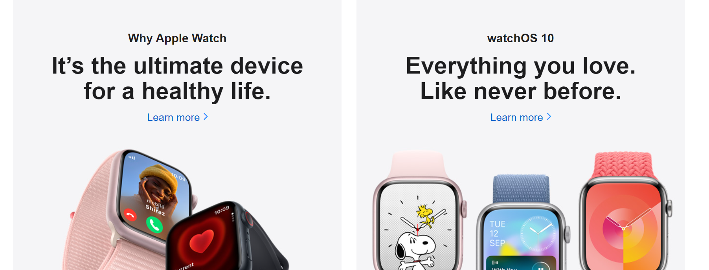

# amazon_Ui
<h2>Hosted Link</h2>
https://shivambansal96.github.io/TEAM-APPLE-GEEKATHON/Watch_by_Abbas/

<h3>Header Section</h3>

 
Header section consist of two sub-sections: search bar section and navbar section. Used flex:display property to make block element inline also used various flex properties to align the content.  Used hover property to change color of text on hovering 

<h3>Hero section</h3>

  
 This section consist of only a Image. The hero section is the prominent and visually impactful area at the top of a web page or digital interface. It serves as the first point of interaction with users, immediately capturing their attention and conveying key information about the website's purpose, content, or message. 

 <h3>Cards section</h3>

 ![Apple-watch-page-card-section]
    
  
  it consist of cards in which we are having image and some information about the image.Cards are often arranged in a grid or stack, making them easy to scan and interact with. They provide a user-friendly way to showcase content, such as articles, products, or user profiles, allowing for organized and engaging presentation of information.>br>

 <h3> Footer Section</h3>

A footer is a designated section typically found at the bottom of a webpage, document, or other digital content. It serves as a way to provide additional information, navigation, or context to users. Footers often include elements such as copyright notices, contact information, links to important pages, social media icons, and disclaimers. They play a crucial role in enhancing user experience by offering relevant information and facilitating easy access to key resources, even when users have reached the end of the main content.